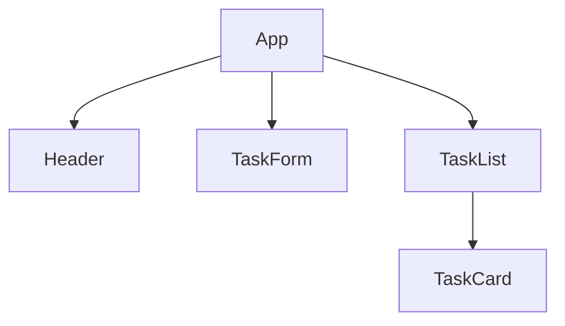
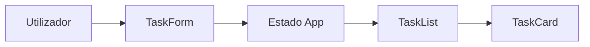
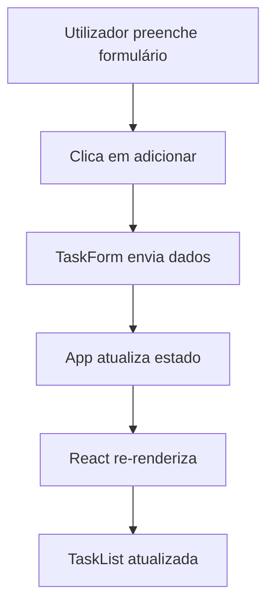

# Arquitetura da Aplicação

## Visão Geral

A aplicação To-Do List React foi concebida utilizando uma arquitetura baseada em componentes.

Cada componente possui uma responsabilidade específica, facilitando a manutenção, reutilização e evolução do sistema.

---

# Objetivos da Arquitetura

- Separação de responsabilidades.
- Código organizado.
- Facilidade de manutenção.
- Escalabilidade.
- Reutilização de componentes.

---

# Estrutura Geral

```text
App
├── Header
├── TaskForm
├── TaskList
│   └── TaskCard
└── Footer (Opcional)
```

---

# Diagrama de Componentes



---

# Responsabilidades dos Componentes

## App

Componente principal da aplicação.

Responsável por:

- Armazenar o estado global das tarefas.
- Coordenar os restantes componentes.
- Gerir a persistência de dados.
- Distribuir dados através de props.

---

## Header

Responsável por:

- Apresentar o título da aplicação.
- Exibir informações gerais.

---

## TaskForm

Responsável por:

- Receber os dados introduzidos pelo utilizador.
- Capturar:
  - Título
  - Descrição
- Solicitar a criação de uma nova tarefa.

---

## TaskList

Responsável por:

- Receber a lista de tarefas.
- Percorrer as tarefas.
- Renderizar múltiplos TaskCard.

---

## TaskCard

Responsável por:

- Exibir uma tarefa individual.
- Exibir título.
- Exibir descrição.
- Exibir estado de favorito.
- Executar ações sobre a tarefa.

---

# Fluxo de Dados

O fluxo de dados seguirá o padrão unidirecional do React.



---

# Fluxo de Criação de Tarefa



---

# Estrutura Inicial de Dados

Cada tarefa será representada por um objeto.

Exemplo:

{
  id: 1,
  title: "Estudar React",
  description: "Rever JSX e useState",
  favorite: false
}

---

# Princípios Arquiteturais

- Single Source of Truth.
- Componentes com responsabilidade única.
- Fluxo de dados unidirecional.
- Estado centralizado no App.
- Persistência desacoplada da interface.

---

# Escalabilidade Futura

A arquitetura permite adicionar:

- Conclusão de tarefas.
- Eliminação de tarefas.
- Edição de tarefas.
- Categorias.
- Pesquisa.
- Filtros.
- Dark Mode.

Sem necessidade de reestruturar completamente a aplicação.

# Fluxo atualizado durante o desenvolvimento
```graphics
Usuário preenche formulário
        ↓
TaskForm
        ↓
cria newTask
        ↓
onAddTask(newTask)
        ↓
App
        ↓
addTask()
        ↓
setTasks(...)
        ↓
tasks muda
        ↓
React renderiza novamente
        ↓
TaskList recebe tasks
        ↓
TaskCard aparece
```