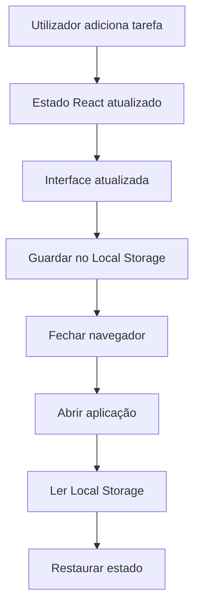
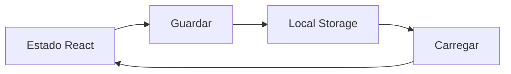

# Persistência de Dados

## Objetivo

Garantir que as tarefas criadas pelo utilizador permaneçam disponíveis mesmo após fechar ou atualizar o navegador.

---

# Tecnologia Escolhida

Local Storage

---

# O que é o Local Storage?

O Local Storage é um mecanismo disponibilizado pelos navegadores que permite armazenar dados localmente no dispositivo do utilizador.

Os dados permanecem disponíveis até serem removidos manualmente.

---

# Motivo da Escolha

A aplicação não possui backend nem base de dados.

Para este projeto, o Local Storage oferece:

- Simplicidade.
- Facilidade de implementação.
- Persistência local.
- Compatibilidade com navegadores modernos.

---

# Ciclo de Vida dos Dados

## Criação

O utilizador cria uma nova tarefa.

↓

O React atualiza o estado.

↓

O estado é guardado no Local Storage.

---

## Recuperação

A aplicação inicia.

↓

O React verifica o Local Storage.

↓

As tarefas guardadas são carregadas.

↓

O estado inicial é restaurado.

---

# Fluxo Completo

---

# Fluxo de Persistência

---

# Estrutura dos Dados Guardados

Exemplo:

[
  {
    "id": 1,
    "title": "Estudar React",
    "description": "Aprender useState",
    "favorite": false
  }
]

---

# Estratégia de Armazenamento

Uma única chave será utilizada.

Nome da chave:

tasks

Exemplo:

tasks = [...]

---

# Benefícios

- Persistência sem servidor.
- Implementação rápida.
- Boa solução para projetos educativos.
- Sem necessidade de autenticação.

---

# Limitações

- Dados limitados ao navegador atual.
- Não existe sincronização entre dispositivos.
- Dados podem ser apagados pelo utilizador.
- Não substitui uma base de dados real.

---

# Evolução Futura

Caso a aplicação cresça, o Local Storage poderá ser substituído por:

- SQLite
- PostgreSQL
- Firebase
- Supabase
- API REST

Sem alterar significativamente a interface da aplicação.